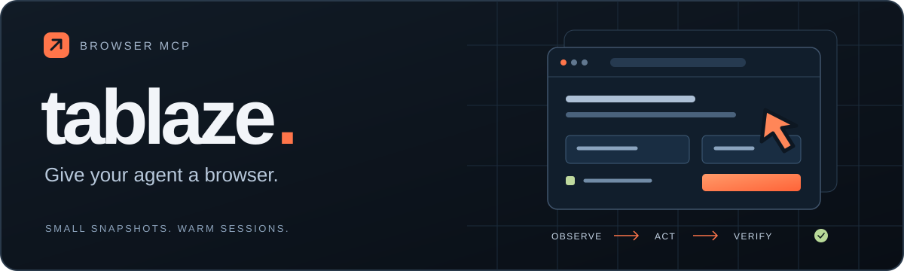
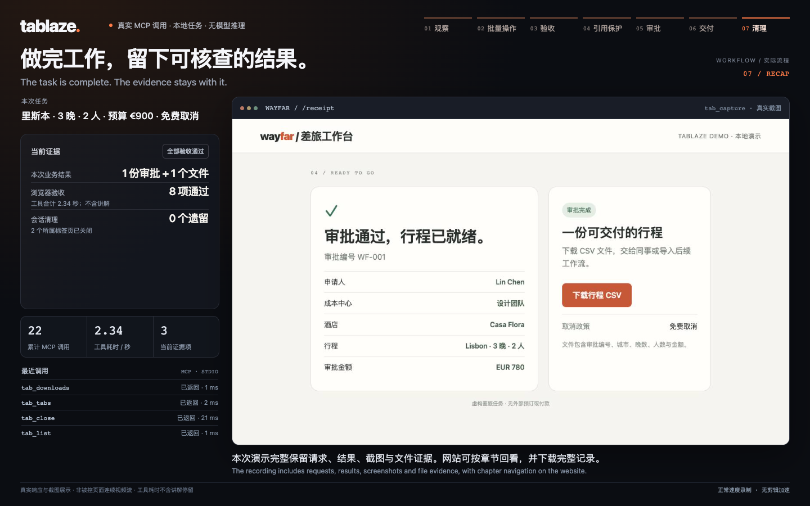

<p align="center">
  <a href="https://tablaze-browser-mcp.isdiandian0825.chatgpt.site?lang=zh">
    
  </a>
</p>

<p align="center">
  <strong><a href="https://tablaze-browser-mcp.isdiandian0825.chatgpt.site?lang=zh">访问官网 ↗</a></strong> &nbsp; · &nbsp;
  <a href="https://tablaze-browser-mcp.isdiandian0825.chatgpt.site?lang=zh#demo">观看真实演示</a> &nbsp; · &nbsp;
  <a href="docs/CODEX.zh-CN.md">Codex 接入指南</a> &nbsp; · &nbsp;
  <a href="README.md">English</a>
</p>

<p align="center">
  <a href="https://github.com/SweetDianDian/tablaze/actions/workflows/ci.yml"></a>
  <a href="LICENSE"></a>
  <a href="package.json"></a>
</p>

**让 Agent 真正操作浏览器。** Tablaze / 闪页通过十六个 MCP 工具，让 Codex 等客户端连接 Chromium：观察页面、填写表单、提取结果，再检查任务是否完成。

基于 Playwright，浏览器会话在调用之间持续运行，推理由你的 MCP 客户端完成。MCP 浏览器工具无需额外模型 API Key；可选独立 Agent 循环使用显式配置的规划器。

## 看它完成一次任务

**[观看完整演示，约 2 分 6 秒 →](https://tablaze-browser-mcp.isdiandian0825.chatgpt.site?lang=zh#demo)**

真实 MCP SDK 客户端走完同一条差旅流程：一次批次执行六个表单动作，完成五项结果验收，再遇到被替换的审批按钮。旧引用被拒绝，未打开审批或写入订单；重新观察后，按明确配置跟随弹窗，完成四步审批与三项回执检查。最后核对下载 CSV 的实际字节和 SHA-256，关闭两个自有标签页，确认剩余会话为零。

[](https://tablaze-browser-mcp.isdiandian0825.chatgpt.site?lang=zh#demo)

`批量填表` → `验收结果` → `停止并重新观察` → `弹窗审批` → `核对文件`

录像长 154 秒，呈现真实工具响应和截图，配有自然的英语男声旁白和可选字幕，不再叠加模拟鼠标。流程由确定性的 SDK 脚本操作本地场景，未调用推理模型；这是展示录屏，并非被控标签页的连续视频流。

[本地复现录制](demo/README.md) · [查看完整调用记录](docs/evidence/demo-run.json)

## 当前量化记录

[第三轮同模型 Codex 对比](docs/CODEX_COMPARISON_RESULTS_V3.md)包含五个可见开发任务，每项任务每引擎运行一次。双方独立业务验收均为 **5/5**；Tablaze 完整成功结束为 **4/5**，Browser Use 为 **5/5**。Tablaze 的订单已写入，但旧推理连接层随后中断，未完成验收和最终报告；失败调用没有用量数据，因此总 tokens 保留未知。

[连接层修复后的独立订单复测](docs/CODEX_TERMINAL_FOLLOWUP.md)中，双方均完整成功，各创建一笔订单，没有重复写入：

| 独立复测指标 | Tablaze | Browser Use |
| --- | ---: | ---: |
| Agent 报告完成 | 59.247 秒 | 75.354 秒 |
| 全程时间 | 59.415 秒 | 93.706 秒 |
| 模型调用，含评审 | 4 | 4（其中评审 1 次） |
| 输入 / 输出 tokens | 59,123 / 664 | 70,868 / 1,002 |

Browser Use 默认评审已计入总时间和用量。Agent 完成与全程时间的起点不同。这次独立复测不替换原来的 4/5；少量可见样本不能证明整体超过 Browser Use。两份报告均保留原始结果、代码哈希、运行条件与限制。

## 开始使用

需要 **Node.js 20+**、npm 和 Git。当前为开发者预览版，npm 尚未发布，请从源码安装：

```sh
git clone https://github.com/SweetDianDian/tablaze.git
cd tablaze
npm ci
npm run build
node dist/cli.js setup
```

<details>
<summary>已安装 Chrome，或者正在使用 Linux？</summary>

已有 Chrome 时可以跳过 `setup`，运行 `node dist/cli.js doctor --channel chrome`，并在下方 Codex 命令末尾追加 `--channel chrome`。这会启动独立浏览器会话。

Linux 使用 `npx playwright install --with-deps chromium` 替代 `setup`，一起安装浏览器和系统依赖。

[浏览器模式与诊断](docs/CODEX.zh-CN.md#1-构建与选择浏览器)

</details>

### 接入 Codex

在克隆后的目录中，注册构建完成的服务：

```sh
codex mcp add tablaze -- "$(node -p 'process.execPath')" "$PWD/dist/cli.js"
codex mcp get tablaze
```

然后告诉 Codex：

> 使用 Tablaze 打开 https://example.com，读取标题和链接，验证页面标题包含“Example Domain”，然后关闭会话。报告这些检查的结果。

[完整接入指南](docs/CODEX.zh-CN.md)包含桌面配置、浏览器选择和排错。其他 MCP 客户端也可以通过 stdio 启动同一个 `node /绝对路径/tablaze/dist/cli.js` 命令。

需要页面内 JavaScript 时，可显式加 `--page-script`，启用 `tab_script`。它拥有页面同源权限，包括读取登录后的数据和发起网络请求；不能与密钥配置、外部 CDP 或导航策略同时使用。每次执行需要当前主框架快照，并返回新快照。详见[页面脚本权限与恢复边界](docs/PAGE_SCRIPT.md)。默认仍为十六个工具。

[独立的原生 Codex 页面脚本复测](docs/CODEX_PAGE_SCRIPT_SMOKE.md)中，Tablaze 与 Browser Use CLI-MCP 各一次通过认证响应任务的服务端验收：每侧恰好一次正确提交、零重复写入。Codex 进程样本分别为 198.359 秒和 239.400 秒；浏览器启动方式不同，不构成受控的速度排名或整体胜出结论。

### 独立执行任务

可选 `run` 命令支持 `codex`、`anthropic`、`ollama`、`openai-compatible` 四类规划器，始终要求明确指定模型。Codex 复用本机 CLI 和已有登录：

```sh
node dist/cli.js run --provider codex --model "<你的Codex模型>" \
  --task "<已授权的任务>" --channel chrome
```

使用 `--output-schema ./result.schema.json` 可要求 Agent 结束前返回符合 JSON Schema 的结构化结果；业务正确性仍需应用验收。恢复运行时须提供相同 Schema。详见 [Agent 约定](docs/AGENT.md)。

SDK 调用方可用 `createAgentControl()` 在安全边界暂停、加入可信操作员指令，再以新计划继续；未执行的写入会跳过，先前的验证必须重做。详见 [运行中干预](docs/AGENT.md#live-operator-intervention-sdk)。

默认兼容提供方仍需 `--endpoint`。原生 Anthropic 和 Ollama 使用各自协议及默认端点；认证、输出参数和模型能力各有边界。详见[提供方配置](docs/PROVIDERS.md)、[CLI 示例](docs/CODEX.zh-CN.md#为-run-选择规划器)和[Agent 验收与恢复](docs/AGENT.md)。Anthropic/Ollama 目前只有本地协议覆盖，尚无真实推理结果；上方历史对比仍对应原来的运行代码哈希。

新 Codex 生产入口另有[独立真实验证](docs/CODEX_PROVIDER_SMOKE.md)：两项任务完整成功并通过服务端验收（2/2），重复写入为 0；不与旧对照数据合并。

新增[虚拟列表同条件任务](docs/CODEX_VIRTUAL_LIST_SMOKE.md)：双方各完整成功一次，独立验收通过且没有重复写入。共同 120,000-token 预算下，Tablaze 全程 86.830 秒，Browser Use 全程 141.597 秒（含默认评审）。单个可见开发任务不能证明整体性能或成功率领先。

[延迟控件开发对照](docs/CODEX_DELAYED_TARGET_SMOKE.md)记录了真实 Codex 在 Tablaze 的一个受保护批次里打开菜单并点击新出现的选项。最后一轮同题尝试双方均一次正确写入、零重复；Tablaze 为 80.715 秒，Browser Use 为 77.720 秒。报告保留了早期角色误猜与恢复轨迹。跨源码阶段的单次样本不能证明稳定速度或整体优势。

另一个[跨来源授权返回任务](docs/CODEX_AUTH_RETURN_SMOKE.md)中，双方也各成功一次，提供方授权和主页面提交均恰好一次。Browser Use 全程 119.515 秒，略快于 Tablaze 的 123.719 秒。该合成弹窗流程不能证明生产登录能力或整体排名。

## 简单的工作流，明确的控制

| 能力 | 给 Agent 带来什么 |
| --- | --- |
| **持续会话** | 调用之间保留页面状态。默认使用临时隔离上下文，也可显式通过 CDP 连接已有 profile。 |
| **自有持久资料** | 可选使用[专有私有 Chrome 目录](docs/PROFILES.md)，再次打开时核对 profile ID，并拒绝并发占用；浏览器管理的登录状态可跨冷启动保留。 |
| **精简观察** | 全量或增量快照，包含元素引用、文字预算与截断标记。 |
| **引用检查** | 输入前检查快照版本和 DOM 目标；目标变化后重新观察。 |
| **顺序批次** | 一次最多提交 20 个操作，分别报告完成、失败和跳过状态。遇错停止，先前操作仍然生效。 |
| **延迟控件** | 点击已观察到的入口后，在同一受保护批次中等待并点击唯一、准确命名的可见按钮或菜单项；重名时输入前停止。 |
| **明确验收** | 核对实际 URL、标题、文字、字段值、可见性与元素数量。已知的同文档结果可在 `tab_act` 批次结束后直接检查，并在同一次调用中形成 Agent 可引用的证据。 |
| **可选响应日志** | 使用 `--capture-network`，通过第十七个 MCP 工具 [`tab_network`](docs/NETWORK.md) 观察自有页面与弹窗的有界响应；默认关闭，尚非通用 JS/CDP 编程入口。 |
| **可选导航策略** | 通过[精确来源允许/拒绝规则](docs/NAVIGATION_POLICY.md)限制自有独立浏览器中的 HTTP(S) 文档请求，覆盖重定向、frame 和弹窗。不支持外部 CDP，也不是网络防火墙。 |

### 十六个工具

| 工具 | 用途 |
| --- | --- |
| `tab_open` | 打开页面并返回首次快照。 |
| `tab_snapshot` | 观察页面、变化或指定 frame。 |
| `tab_find` | 在页面或已观察的虚拟列表容器中滚动查找文字，返回可操作的新快照。 |
| `tab_act` | 受保护的表单操作、拖拽、容器滚动、文件选择与坐标操作；可选动作后检查。 |
| `tab_verify` | 执行页面断言，通过受保护的 ref 或 CSS 选择器验收表单值。 |
| `tab_extract` | 读取文字、链接或表格。 |
| `tab_capture` | 获取 JPEG 截图。 |
| `tab_list` | 查看自有会话。 |
| `tab_close` | 关闭会话并释放资源。 |
| `tab_navigate` | 在会话内前进、后退、刷新或导航。 |
| `tab_tabs` | 创建、切换和关闭自有标签页，接续弹窗流程。 |
| `tab_downloads` | 查看下载状态与本地文件。 |
| `tab_dialog` | 为下一次原生对话框设置接受或取消响应。 |
| `tab_state` | 导出可用于新会话恢复的登录状态文件。 |
| `tab_extract_structured` | 按 JSON Schema 提取类型化字段，返回 DOM 来源证据。 |
| `tab_pdf` | 导出私有 PDF 文件，返回来源 URL 和 SHA-256。 |

当前开发分支增加定向/视口快照、统一 Shadow DOM 读取、拖拽、容器滚动、文件流程、多标签页、[结构化提取](docs/EXTRACTION.md)和可断点恢复的[模型驱动 Agent](docs/AGENT.md)。新增能力尚未发布到 npm，已验收范围见[开发状态](docs/DEVELOPMENT_STATUS.md)。[Browser Use 对照与未完成验收](docs/BROWSER_USE_COMPARISON.md)明确记录差距，不宣称已超过对方。

## 深入了解

| 文档 | 内容 |
| --- | --- |
| [Codex 接入](docs/CODEX.zh-CN.md) | 可复制的配置、工具参数与排错。 |
| [运行机制](docs/RUNTIME.md#简体中文) | 引用生命周期、批次语义、浏览器模式与当前限制。 |
| [类型化自定义工具](docs/CUSTOM_TOOLS.md) | SDK Schema、可信应用上下文、浏览器绑定与恢复约定。 |
| [模型提供方](docs/PROVIDERS.md) | Codex CLI、原生 Anthropic/Ollama 与兼容 HTTP 的协议、认证及用量。 |
| [导航策略](docs/NAVIGATION_POLICY.md) | 可信 CLI/SDK 配置、仅文档请求的范围、连接中断边界与恢复策略身份。 |
| [定向凭据](docs/SECRETS.md) | 可信别名、精确来源登录填写、遮盖边界与恢复。 |
| [Browser Use 多入口审计](docs/BROWSER_USE_VARIANTS.md) | 区分 Agent、MCP、Harness、Pi 和云服务；源码审计不等于性能测量。 |
| [基准测试](bench/README.md) | 复现本地场景，检查每个原始样本。 |
| [验证记录](docs/VALIDATION.md) | 真实浏览器、SDK 与 Codex 的结果和验证范围。 |
| [安全边界](SECURITY.md) | 数据处理、资源归属与私密漏洞报告。 |
| [发布打包](docs/RELEASE.md) | 生成 npm 安装包和源码归档。 |

[历史 0.1.0 的 Ubuntu Node 20/22 CI](https://github.com/SweetDianDian/tablaze/actions/runs/35696802909)已通过当时的构建、浏览器/MCP 测试和包内容检查；后续[包含提供方适配器的提交 `c9d091a` 的 Ubuntu Node 20/22 CI](https://github.com/SweetDianDian/tablaze/actions/runs/35736979945)两个任务也均已通过。该次运行早于本轮导航策略改动。当前开发分支的验收[单独记录](docs/DEVELOPMENT_STATUS.md)。源码目录中运行 `npm test` 可执行测试；`npm run bench` 单独运行本地基准。

## 参与贡献

带来一个可复现的浏览器案例，改进一份指南，或提交一项聚焦修复。[提交 Issue](https://github.com/SweetDianDian/tablaze/issues) · [提交 Pull Request](https://github.com/SweetDianDian/tablaze/pulls) · [贡献指南](CONTRIBUTING.md)

[MIT 许可证](LICENSE) · [依赖署名与项目来源](NOTICE)
