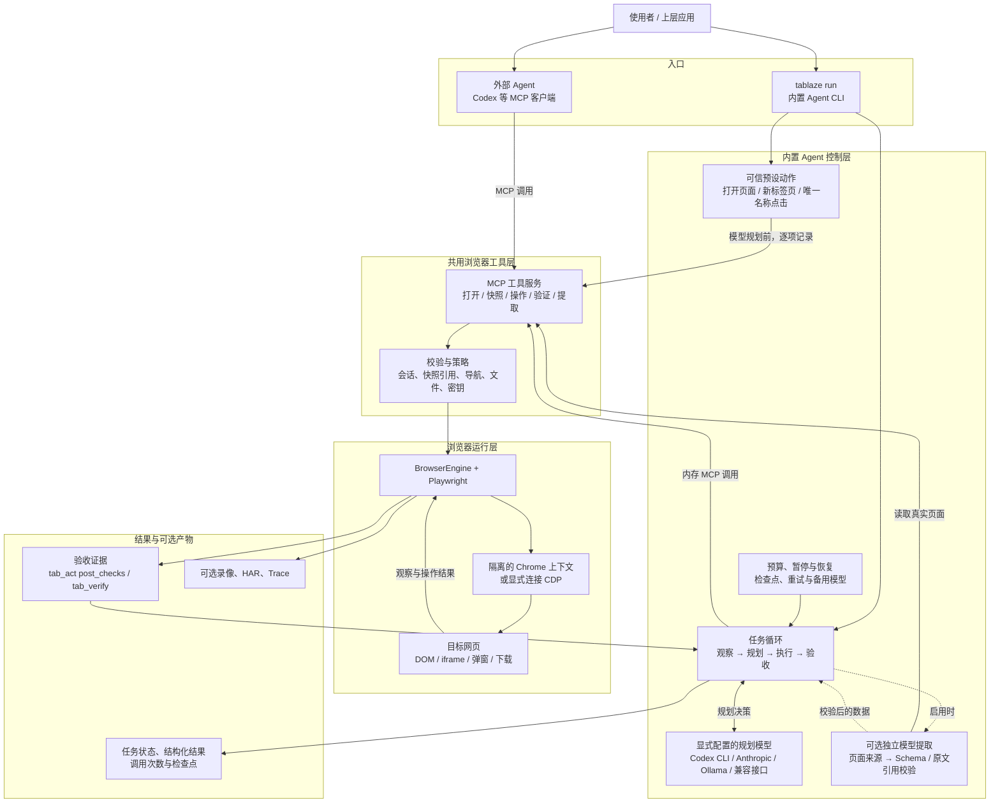

# Tablaze 架构图

下图描述当前代码中的真实运行链路。两种入口共用浏览器工具层：外部 Agent 自己决定下一步；`tablaze run` 使用显式配置的模型执行内置 Agent 循环。

**验收边界：**浏览器工具执行成功不等于用户任务完成。内置 Agent 只有在当前会话的操作之后取得通过的验收证据，才可报告成功；跨页面跳转后的结果需要重新观察和验证。写入操作在恢复时不会自动重放。

**独立系统：**官网及演示视频是静态展示，不在任务执行链路内；`bench/comparison` 是独立的 Browser Use 对比基准，用相同任务、模型配置和服务端业务验收记录两侧结果。架构图表示已实现的模块，不表示已经达到 Browser Use 的功能或效率全面对等。
