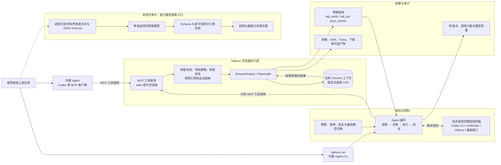

# Tablaze 架构图

以下区分已发布的浏览器/Agent 主链路，与仍在本地开发的独立模型提取入口。官网演示页面是静态展示层，不参与真实浏览器任务执行。

外部 MCP 模式由客户端决定下一步，Tablaze 只执行浏览器工具，不自行调用模型。`tablaze run` 则将显式配置的模型接入同一套浏览器工具；完成状态需要当前会话中的实际验收证据。浏览器写入在故障恢复时不会自动重放。独立提取入口读取调用方给出的文本，不自行打开来源网址；这条路径尚未并入 Agent 的页面任务流程。
