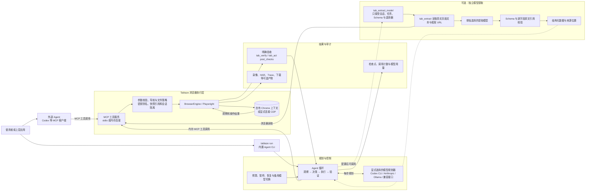

# Tablaze 架构图

以下展示浏览器/Agent 主链路，以及配置 `--extraction-model` 后接入 Agent 的独立模型提取流程。官网演示页面是静态展示层，不参与真实浏览器任务执行。

外部 MCP 模式由客户端决定下一步，Tablaze 只执行浏览器工具，不自行调用模型。`tablaze run` 则将显式配置的模型接入同一套浏览器工具；完成状态需要当前会话中的实际验收证据。CLI 默认禁止模型读取任意本机上传文件，操作员可提供受信任文件清单或在启动时导入私有认证状态；这两项策略与检查点绑定。浏览器写入在故障恢复时不会自动重放。配置独立提取模型后，Agent 可调用 `tab_extract_model`，它从当前浏览器会话读取来源，不接受模型伪造的页面文本或 URL。提取结果的原文引用仅证明片段存在；Agent 仍需页面核验，业务语义与完整性还需应用验收。独立的 `tablaze-extract` 命令仍可处理调用方提供的多个来源文本。
